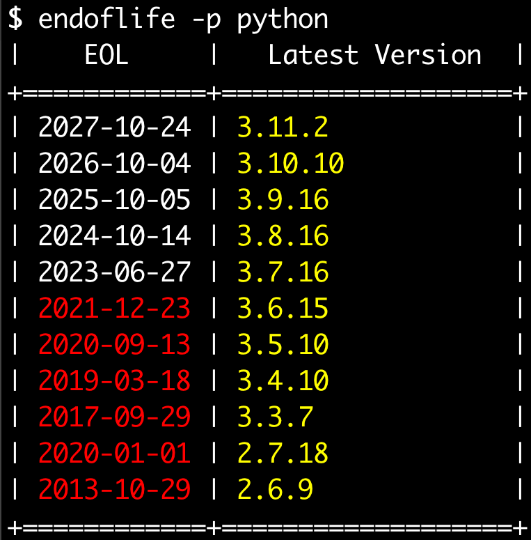

# Endoflife Command Line

I'm using this project to learn the Go programming language. 

The [Endoflife.date](https://endoflife.date) API is the source for all the information, and this tool would require a network connection to work.

## Installation

```
$ go build
```

If you want to use `go install`, first run this command to find your go environment's path:

```
$ go env GOPATH
```

Then, add that path with "/bin" attached to it to your local PATH. This will allow you to run `go install` on any local go project and have the binary installed to an accessible PATH. 


## Running

Run the command with just a product to show the End of Life dates for all product cycles, with color output.



You can also run the command targeting a specific product cycle, and it will return the latest version of that product cycle:

```
$ endoflife -p ruby -c 3.2
|    EOL     |   Latest Version  |
+============+===================+
| 2026-03-31 | 3.2.1             |
+============+===================+
```